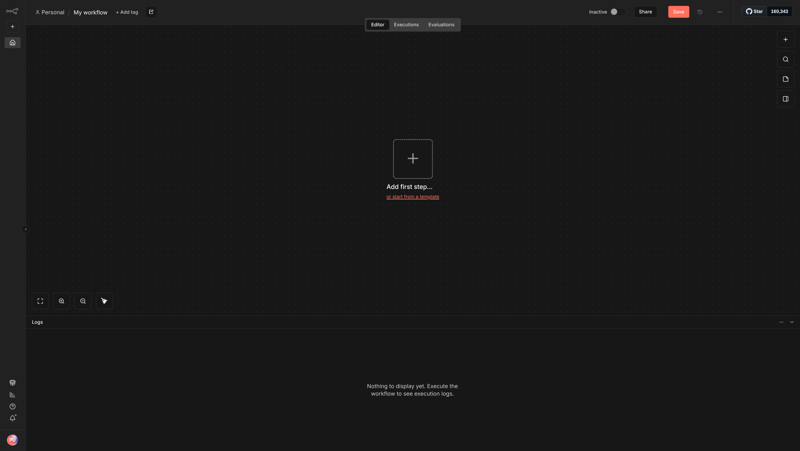
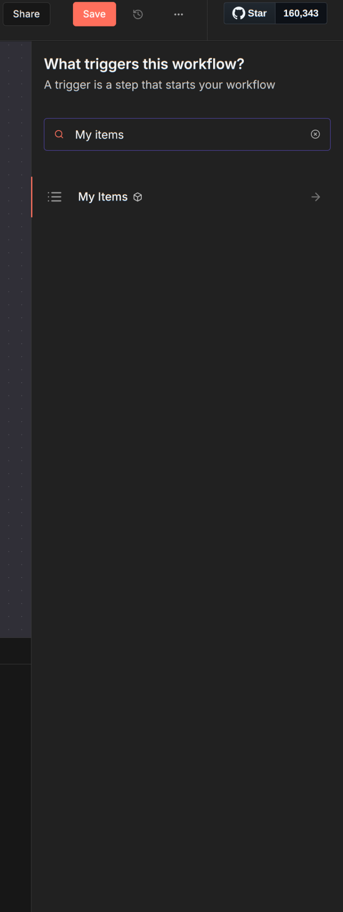
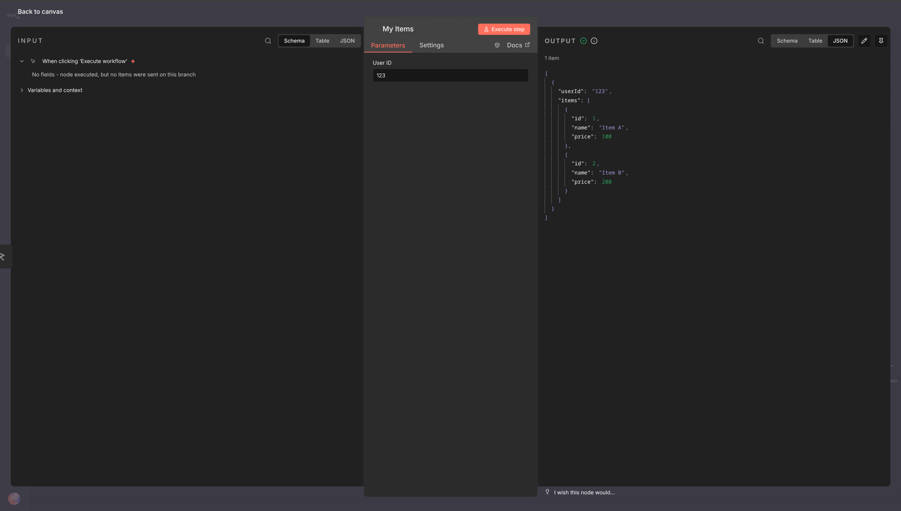

# Custom Node
#n8n #automation 


[n8n manual](https://docs.n8n.io/integrations/creating-nodes/overview/)

Custom nodes can build with 2 approaches:
- declarative style
	- JSON based syntax (still typescript but its just build json with ts syntax),
	- Supports integration with REST API
- programmatic style
	- for nodes which require some data transformation
	- any node that isn't REST-based.

### Example

Here we implement example of some simple custom node in programmatic style.

Helpful links:
- https://github.com/n8n-io/n8n-nodes-starter/blob/master/README.md
- https://docs.n8n.io/integrations/creating-nodes/build/
- https://docs.n8n.io/integrations/creating-nodes/build/declarative-style-node/

Main task of our custom node will be call our custom test server which have GET method `items/${userId}` where `userId` - some int value  which represent user. In response we expect  array of items (we not interested now in meaningful data, so its will be some dummy data).

##### Prerequisites

1) [install nodejs and npm ](https://nodejs.org/en/download)
2) install n8n globally with -  `npm install n8n -g`

not required but helpful -[install git](https://git-scm.com/install/)

##### Code for custom node

We will create node with `typescript`

First we need create new project which can be done with:
1) create new directory - `mkdir my-node`
2) enter into directory - `cd my-node`
3) run - `npm init`

Next we need change `package.json`, example bellow:

```json
{
  "name": "n8n-nodes-myitems",
  "version": "0.1.0",
  "description": "Fetch items by user ID",
  "license": "MIT",
  "keywords": [
    "n8n-community-node-package"
  ],
  "homepage": "",
  "author": {
    "name": "",
    "email": ""
  },
  "files": [
    "dist"
  ],
  "repository": {
    "type": "git",
    "url": "https://github.com/<...>/n8n-nodes-<...>.git"
  },
  "scripts": {
    "build": "n8n-node build",
    "build:watch": "tsc --watch",
    "dev": "n8n-node dev",
    "lint": "n8n-node lint",
    "lint:fix": "n8n-node lint --fix",
    "release": "n8n-node release",
    "prepublishOnly": "n8n-node prerelease"
  },
  "n8n": {
    "n8nNodesApiVersion": 1,
    "nodes": [
      "nodes/MyItems/MyItems.node.js"
    ]
  },
  "devDependencies": {
    "@n8n/node-cli": "*",
    "eslint": "9.32.0",
    "prettier": "3.6.2",
    "release-it": "^19.0.4",
    "typescript": "5.9.2"
  },
  "peerDependencies": {
    "n8n-workflow": "*"
  }
}

```

Next we need add or update `tsconfig.json` because we use typescript instead plain javascript

```json
{
  "compilerOptions": {
    "strict": true,
    "module": "commonjs",
    "moduleResolution": "node",
    "target": "es2019",
    "lib": ["es2019", "es2020", "es2022.error"],
    "removeComments": true,
    "useUnknownInCatchVariables": false,
    "forceConsistentCasingInFileNames": true,
    "noImplicitAny": true,
    "noImplicitReturns": true,
    "noUnusedLocals": true,
    "strictNullChecks": true,
    "preserveConstEnums": true,
    "esModuleInterop": true,
    "resolveJsonModule": true,
    "incremental": true,
    "declaration": true,
    "sourceMap": true,
    "skipLibCheck": true,
    "outDir": "./dist/"
  },
  "include": ["credentials/**/*", "nodes/**/*", "nodes/**/*.json", "package.json"]
}

```

After that create next entities:
- in root create folder `nodes`
- in `nodes` create 2 files
	- `MyItems.node.json`
	- `MyItems.node.ts`

Add into `MyItems.node.json` next json:

```json
{
  "node": "n8n-nodes-base.myItems",
  "nodeVersion": "1.0",
  "codexVersion": "1.0",
  "categories": ["Development"],
  "resources": {
    "primaryDocumentation": [
      {
        "url": "http://localhost:3000"
      }
    ]
  }
}

```

Add into `MyItems.node.ts` next code:

```ts
import {
  IExecuteFunctions,
  INodeExecutionData,
  INodeType,
  INodeTypeDescription,
} from 'n8n-workflow';

export class MyItems implements INodeType {
  description: INodeTypeDescription = {
    displayName: 'My Items',
    name: 'myItems',
    icon: 'fa:list',
    group: ['transform'],
    version: 1,
    description: 'Get items by user ID',
    defaults: {
      name: 'My Items',
    },
    inputs: ['main'],
    outputs: ['main'],
    properties: [
      {
        displayName: 'User ID',
        name: 'userId',
        type: 'number',
        default: 123,
        required: true,
        description: 'The user ID to fetch items for',
      },
    ],
  };
}

  async execute(this: IExecuteFunctions): Promise<INodeExecutionData[][]> {
    const items = this.getInputData();
    const returnData: INodeExecutionData[] = [];

    for (let i = 0; i < items.length; i++) {
      const userId = this.getNodeParameter('userId', i) as number;

      const response = await this.helpers.request({
        method: 'GET',
        url: `http://localhost:3000/items/${userId}`,
        json: true,
      });

      returnData.push({ json: response });
    }

    return [returnData];
  }
}

```


On this our  code part is done.

> NOTE: in package.json we have important piece of config for n8n 
> ```json
>   "n8n": {
    "n8nNodesApiVersion": 1,
    "nodes": [
      "nodes/MyItems/MyItems.node.js"
    ]
  }
> ```
> Why do we use MyItems.node.js instead .ts file which we created?
> The reason that n8n do not support (as major solutions) typescript - n8n need js file which we will get in next step.


##### Build 

Now our code is ready and we need build our node. Todo that run:
- `npm install` - to install all deps. On this step you should see new folder `node_modules` where all dependency storing.
- `npm run build` - build our node. On this step you should see new folder in root - `dist`, where our built node is placed.
- now go into `dist/` folder
- run `npm link` which create for npm link to our node which can be used anywhere in our system.
- go into main n8n folder `cd ~/.n8n/nodes/`
- in that folder run command `npm link n8n-nodes-myitems` where `n8n-nodes-myitems` its a name of our node which you can find in package.json name property
Done! We crate our node and link its with our locally installed n8n.

Last step - run  n8n with command `N8N_ENFORCE_SETTINGS_FILE_PERMISSIONS=false n8n start`. That command will run n8n instance, and setup UI usually on `:5678` port.

Now lets go into browser and open link `http://localhost:5678`. First time its will ask you to create accound, just enter all required data.

Boom! you should be here 



Now press "+" button and search for 



And when we add that node to workflow we can setup and set our field User ID to make the request.



#### Additions

Test server which i use in test 

```js
const express = require('express');
const app = express();
const PORT = 3000;

// Mock data
const userItems = {
    123: [
        { id: 1, name: 'Item A', price: 100 },
        { id: 2, name: 'Item B', price: 200 }
    ],
    456: [
        { id: 3, name: 'Item C', price: 150 },
        { id: 4, name: 'Item D', price: 300 }
    ]
};

app.get('/items/:userId', (req, res) => {
    const userId = req.params.userId;
    const items = userItems[userId] || [];
    res.json({ userId, items });
});

app.listen(PORT, () => {
    console.log(`Server running on http://localhost:${PORT}`);
});
```