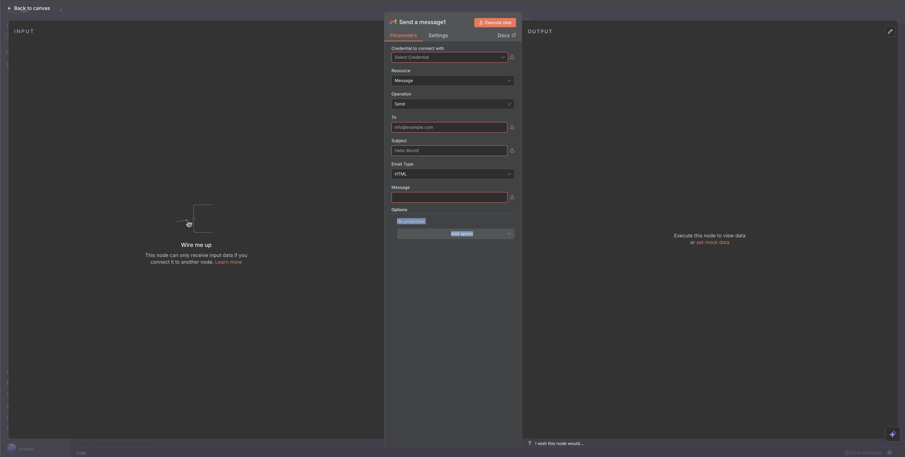
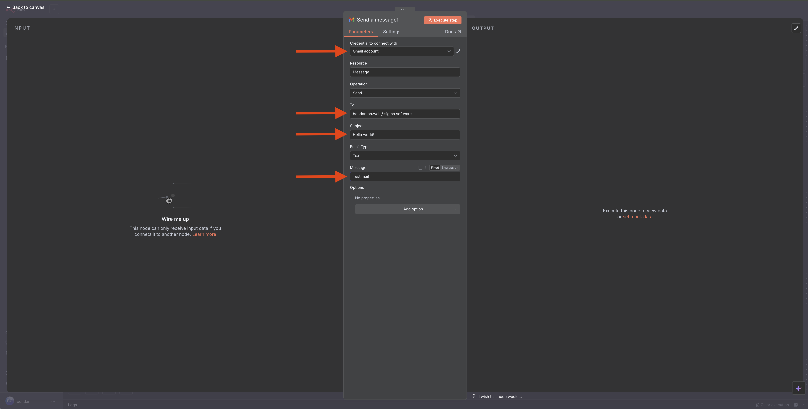

#google #n8n #automation
# Integration n8n with Google API

Google integration needed to operate with Emails and Meetings (and other Google applications if needed)

Links:
 - https://docs.n8n.io/integrations/builtin/app-nodes/n8n-nodes-base.gmail/?utm_source=n8n_app&utm_medium=node_settings_modal-credential_link&utm_campaign=n8n-nodes-base.gmail

Result of this tutorial:
 - get access to Google Apps from n8n

## Flow

Start from n8n

    -> Create or goto create worflow
    -> Click "+" button and type "google" in search bar
    -> Click on "Send a message" action
    -> Click on newly added node 

    -> Click on "Credential to connect with" and add new credential
    -> Leave defaul, recommended, connection with OAuth2
    -> Click on "Sign in with Google" button 
    -> For text select all options. If you know what you need, and want restrict some scopes - select only them
    -> enter target email in "To" input
    -> enter subject and Message
    -> Click on "Execute step" to test

Done!