#slack #n8n #automation 
# Integration n8n with Slack API


Links:
- https://docs.slack.dev/
- https://api.slack.com/apps
- https://docs.n8n.io/integrations/builtin/credentials/slack/
- https://docs.n8n.io/integrations/builtin/app-nodes/n8n-nodes-base.slack/#templates-and-examples
- https://docs.n8n.io/integrations/builtin/credentials/slack/#using-api-access-token

Result of this tutorial:
- Slack API token which allow us read,write and search in our Slack workspace

## Prerequisition

- First you need create our own or get admin access to exsting Slack Workspace

## Flow
We will use API access token to Slack.

https://docs.n8n.io/integrations/builtin/credentials/slack/#using-api-access-token

    -> Slack API, Your Apps

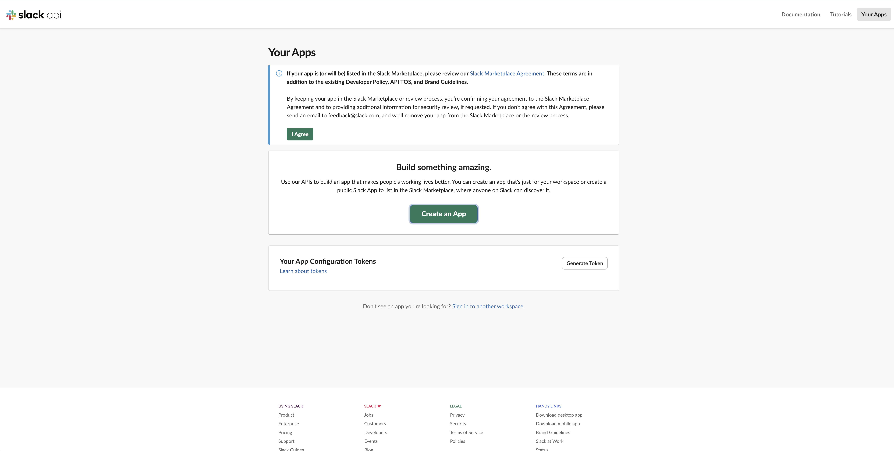

    -> Press button "Create an App"
    -> Select "From scratch"

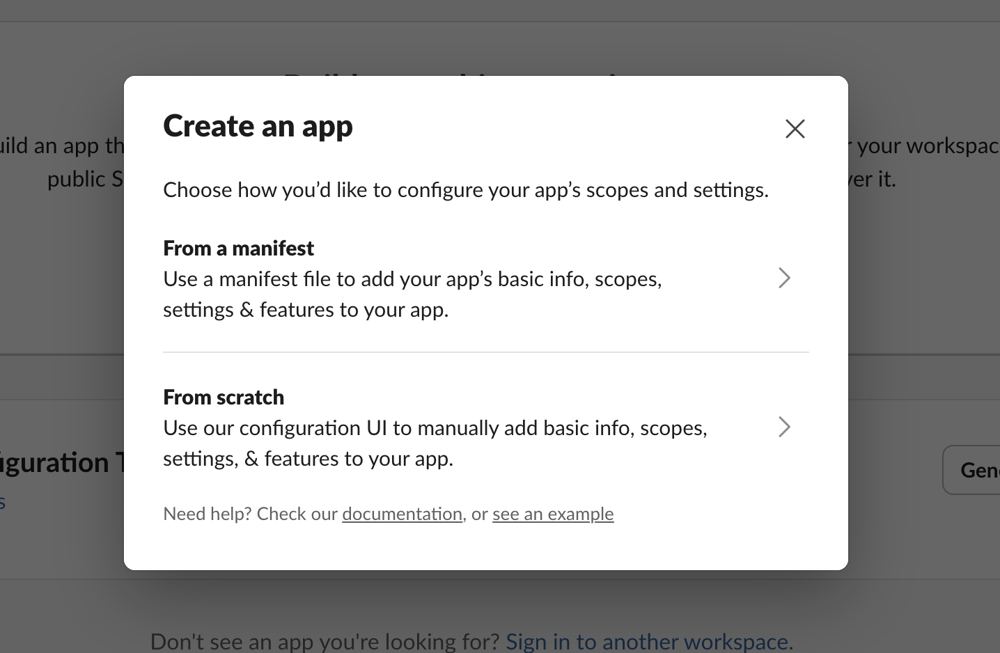

    -> Enter the App Name
    -> Select created beforehand workspace

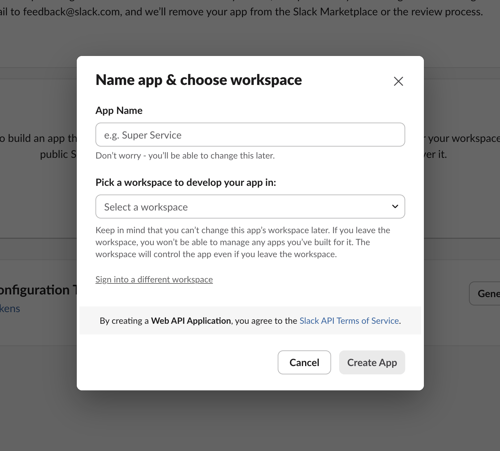
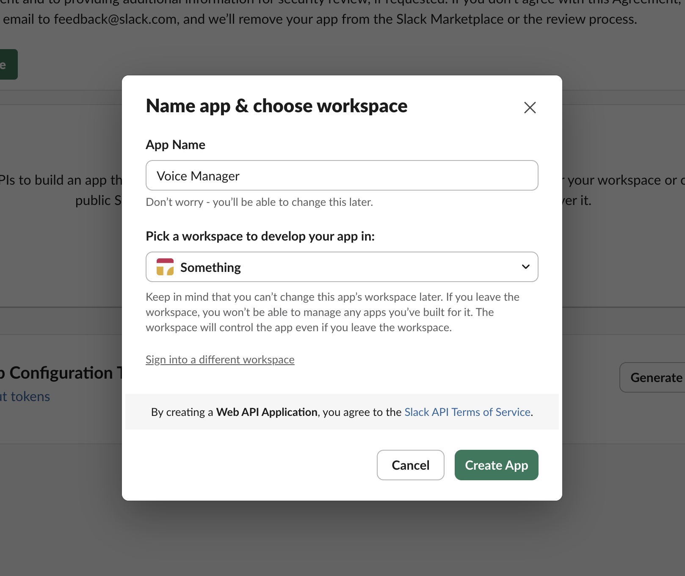

    -> Then, goto OAuth & Permissions menu

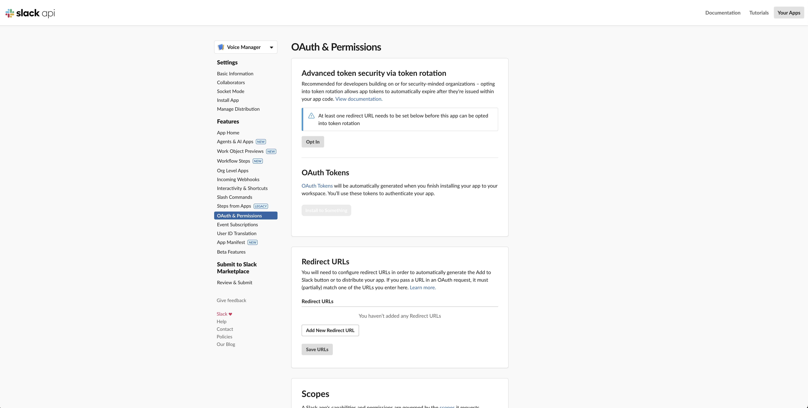

    -> Add scopes

I will add next scopes (you can find full list of scopes [here](https://docs.slack.dev/reference/scopes/) and decide for yourself what you need)

```
channels:history
channels:read
groups:history
groups:read
im:history
mpim:history
chat:write
chat:write.public
files:read
files:info
files:write
reactions:read
reactions:write
users:read
```

    -> after selecting all required scopes goto OAuth Tokens section (on the same page) and press "Install to < Your workspace name >"

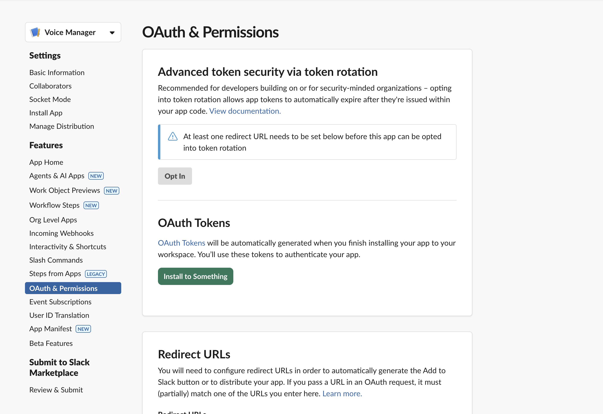

    -> you will be redirected to Intall page, here press "Install < Your workspace name > " button
> important! you should be admin 


Final step

    -> Copy the "Bot User OAuth Token" and save for n8n credentials for slack integrations

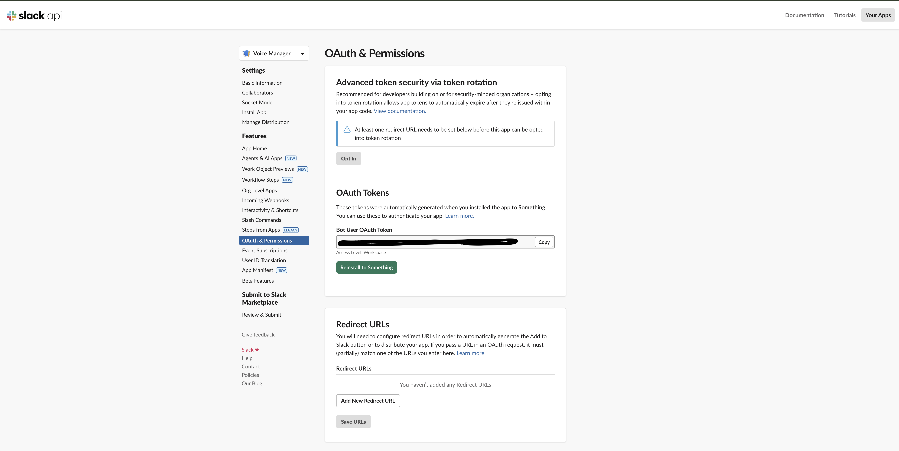


### Validation

    -> Goto your n8n workspace and create empty workflow
    -> Press "+" sign and type "slack" into search

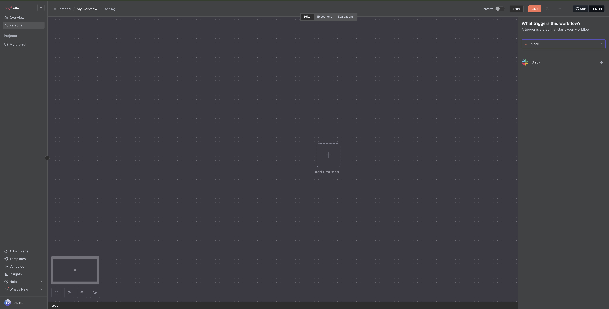

    -> click on "Slack option", its will open sub menu
    -> seach for "Send a message" action and then click on it
    -> that should add into your workspace new node

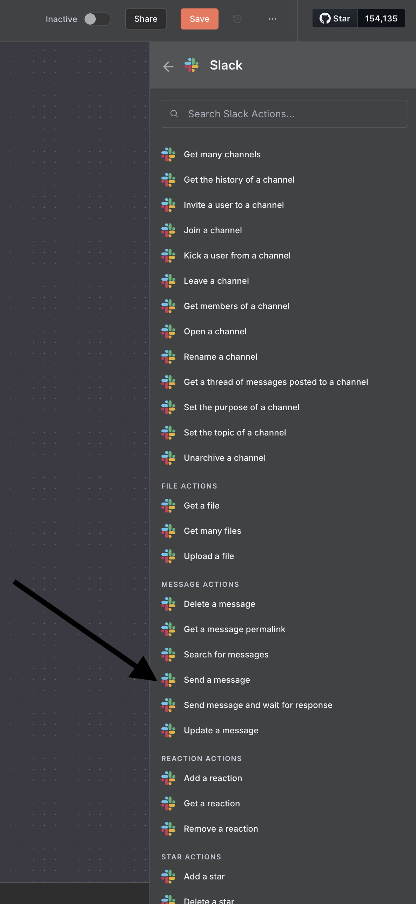

    -> double click on newly created node
    -> click in field "Credential to connect with". that will open modal where you can enter slack api token, no other changes needed, you can save
        -> optionaly you can change cred name but click in title and rename credential (its caan be usefull if you need for some reason manage couple slack apis in same n8n project)

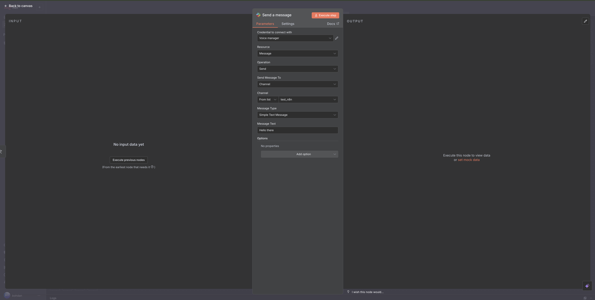

    -> after that select in "Send message To" option Channel 
    -> from channel list select one which your's test channel
    -> fill "Message Text" with some message
    -> Press "Execute step" button

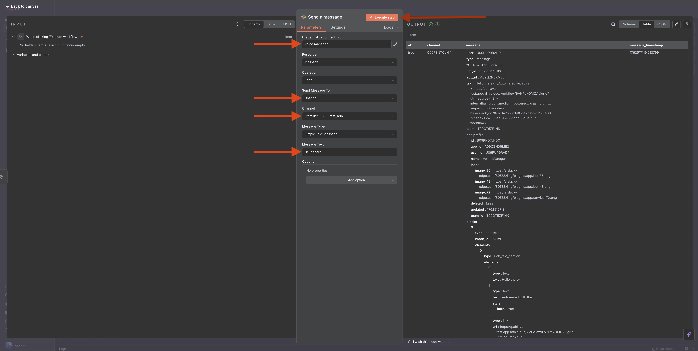

Result


## Register n8n url as subsription

Goto slack api and insert here you n8n hook url

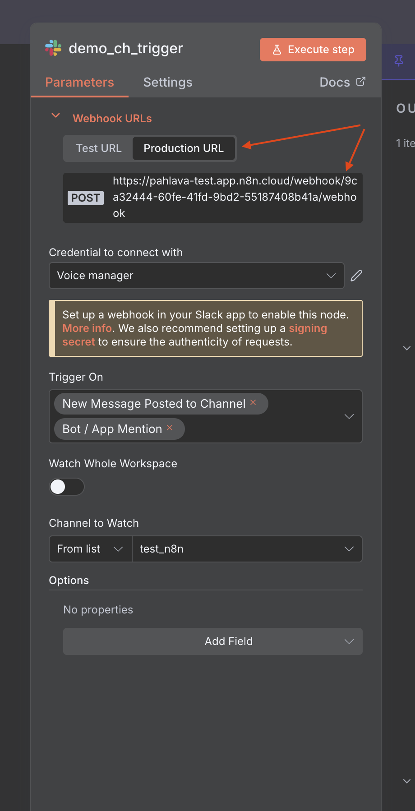
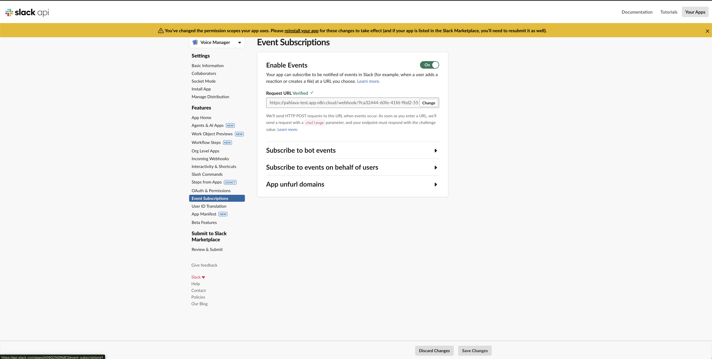

