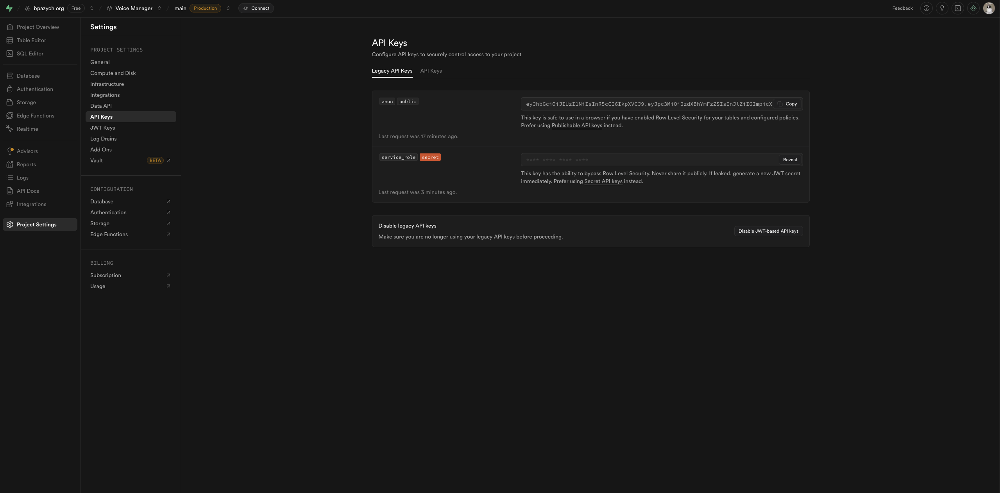
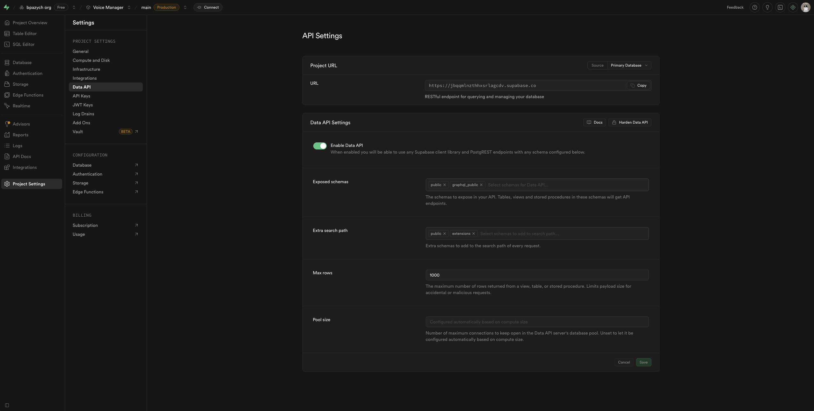
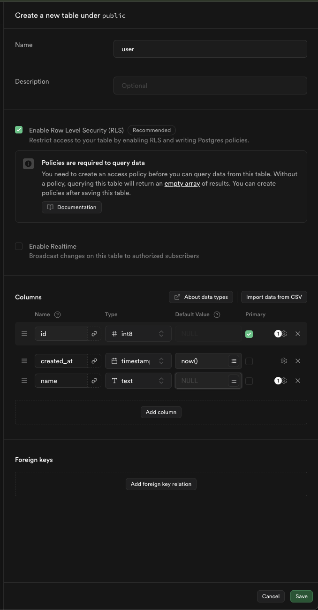
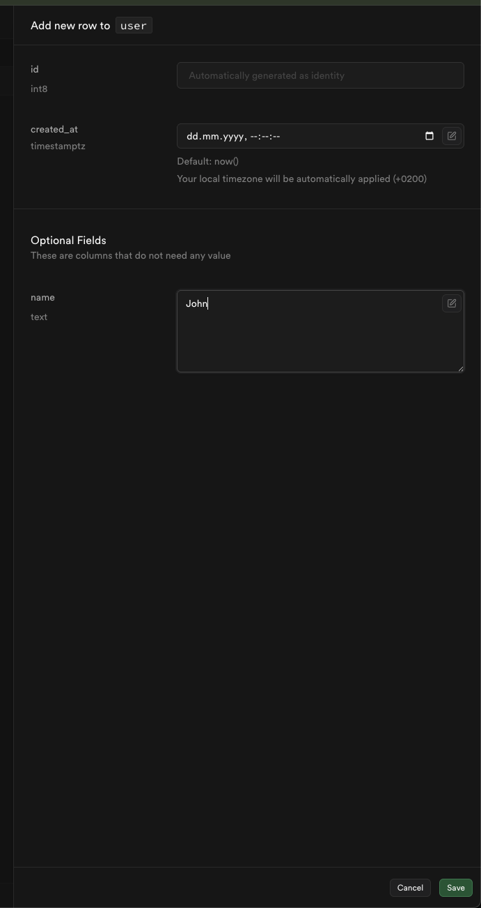
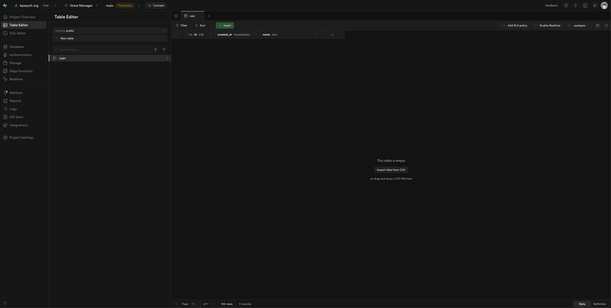

#supabase #n8n #automation 
# Integration n8n with Supabase API

Main target for Supabase its provide Database and File Storage.

Links:
- https://docs.n8n.io/integrations/builtin/app-nodes/n8n-nodes-base.supabase/?utm_source=n8n_app&utm_medium=node_settings_modal-credential_link&utm_campaign=n8n-nodes-base.supabase
- https://docs.n8n.io/integrations/builtin/credentials/supabase/

Result of this tutorial:
- get Supabase host for integration with n8n
- get Service Role Secret

## Prerequision

Create own organisation and project here - https://supabase.com/

## Flow

    -> Goto project settings
    -> Goto Legacy API Keys 
    -> Reveal and copy service_role secret

> note: for now n8n supabase node **do not** support connection via new supabase API Keys. But you can bupass that with HTTP Request node if needed

    -> Now goto Settings->Data API and copy "Project URL" 
    -> Save both - service role secret and project URL - we will need that to connect from n8n

    -> Now lets mock some data to select that from n8n
    -> Goto Database

    -> Create new test table "user"

    -> Lets add new user. Todo that goto Table Editor
    -> Click on "Insert" button and select "Insert Row"
    -> Input some test name for new user and save

    -> Goto you n8n workflow or create new one
    -> Click on "+" button and search for "supabase"
    -> Click on first option "Supabase" and then in submenu click on "Get many rows" to return list 
    -> Click on newly added node
    -> Click on "Credential to connect with" and create new credentials
        -> As "Host" use "Project URL" from Supabase
        -> As "Service Role Secret" use service_role secret from Supabse
    -> Save

    -> Now select user table from "Table Name or ID" input 
    -> Click on "Execute step" button
    -> Done! You get user list from Supabase Database

